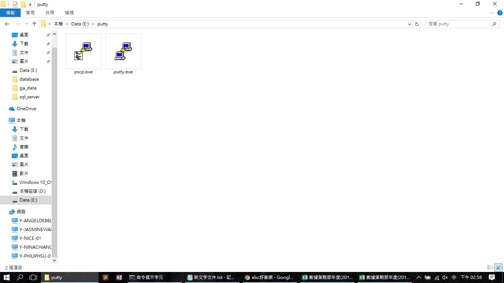
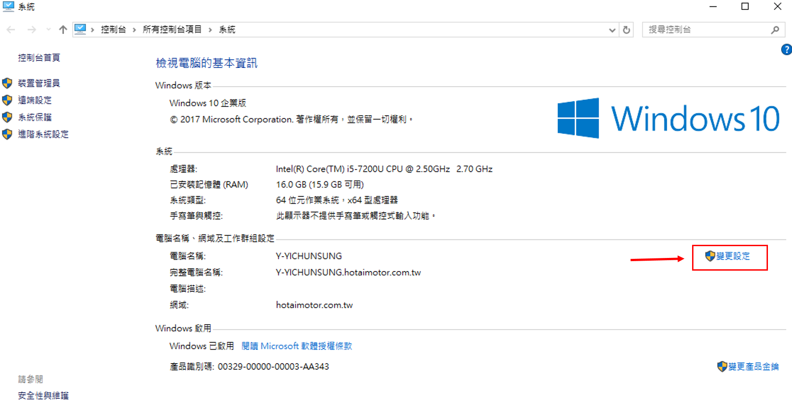
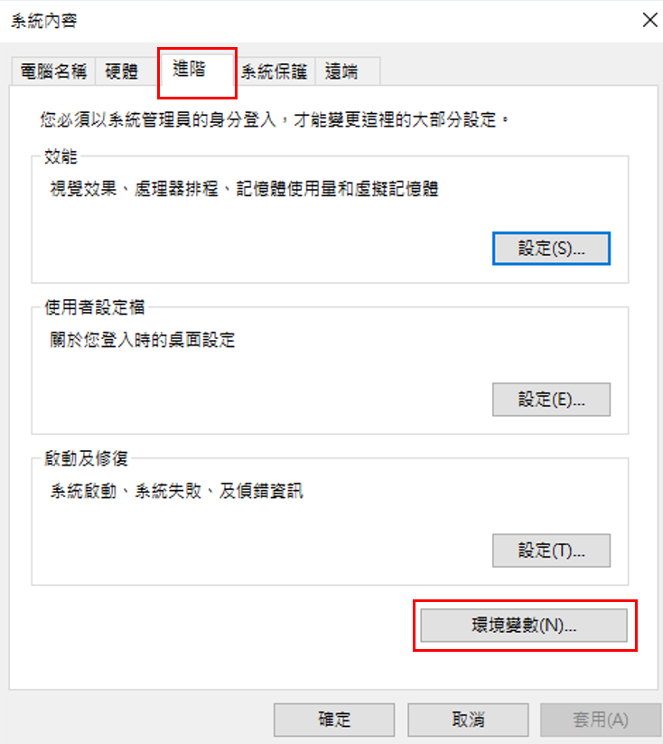
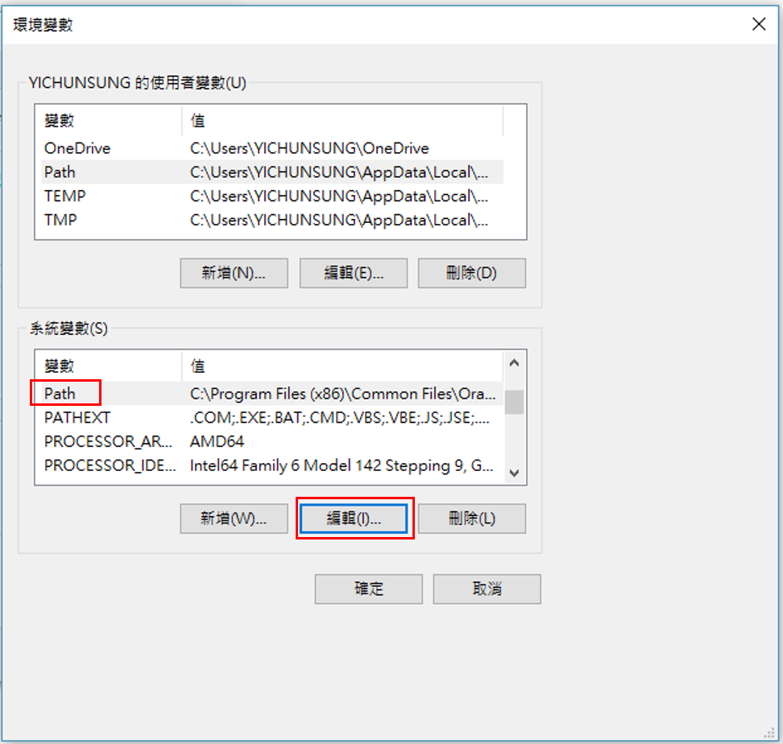
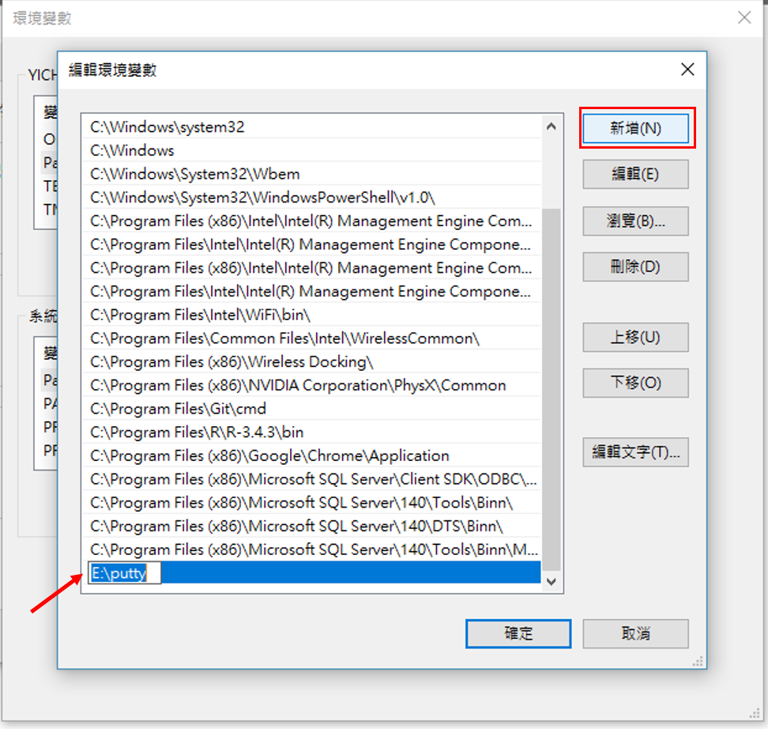
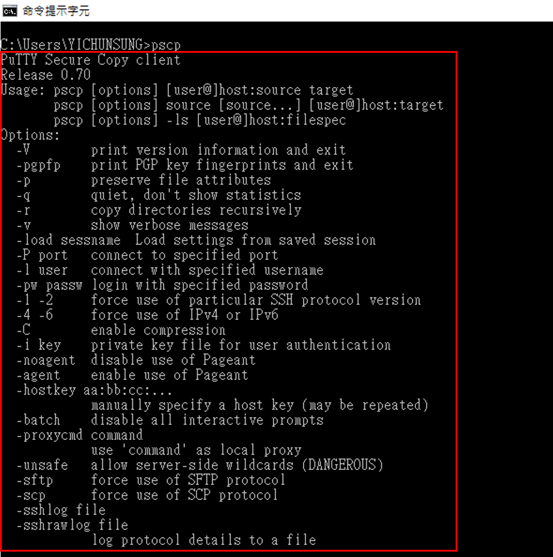

# AWS基本設定


## 利用終端機登入(MAC)

開啟終端機，確認AWS ip位置，並且確定pem檔路徑。

2-xx-xxx-xxx-xxx 為該AWS上之路徑
```

ssh -i "yourKey_path.pem" ubuntu@ec2-xx-xxx-xxx-xxx.ap-northeast-1.compute.amazonaws.com

```

## 利用pscp傳送檔案到AWS上(Windows)

### Step 1 : 
可以從PuTTY[官方](https://www.chiark.greenend.org.uk/~sgtatham/putty/latest.html)下載putty.exe以及pscp.exe。

### Step 2 :
將下載好的資料全部放置在同一個資料夾。


### Step 3 :
設定環境變數。

(1) 開啟「我的電腦」，於空白處按右鍵，然後點選「內容」，點選「變更設定」。


(2) 在上方的頁籤中選擇「進階」，然後點選下方的「環境變數」。


(3) 接著會跳出「環境變數」的視窗，在下方「系統變數」的區塊中找到名為「Path」的變數並按下下方的「編輯」按鈕。


(4) 將putty資料夾所在的路徑加到「變數值」中，並按確定。



### Step 4 :
開啟命令提示字元，輸入pscp確認環境變數新增成功。



### Step 5 :
利用以下指令將檔案傳輸至AWS上

2-xx-xxx-xxx-xxx 為該AWS上之路徑
```

pscp -i e:\yourKeyPath.ppk -l ubuntu ec2-ubuntu "your file path" ec2-xx-xxx-xxx-xxx.ap-northeast-1.compute.amazonaws.com:/home/ubuntu/your_path

```

顯示出100%的字樣，就代表傳送成功囉。


## Reference

[Putty - 使用PSCP在Linux與Windows間傳送檔案](https://jeremysu0131.github.io/Tool-Putty-使用PSCP在Linux與Windows間傳送檔案/)
[在Linux與Windows間傳送檔案 – 步驟教學](https://loveamberbird.wordpress.com/2013/08/21/【筆記】在linux與windows間傳送檔案步驟教學/)